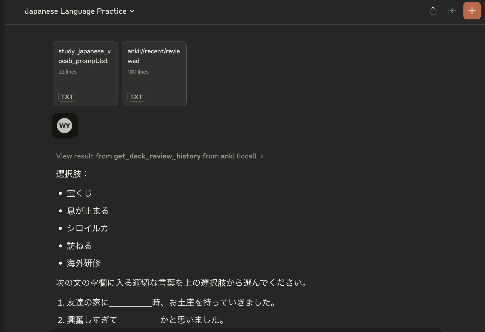
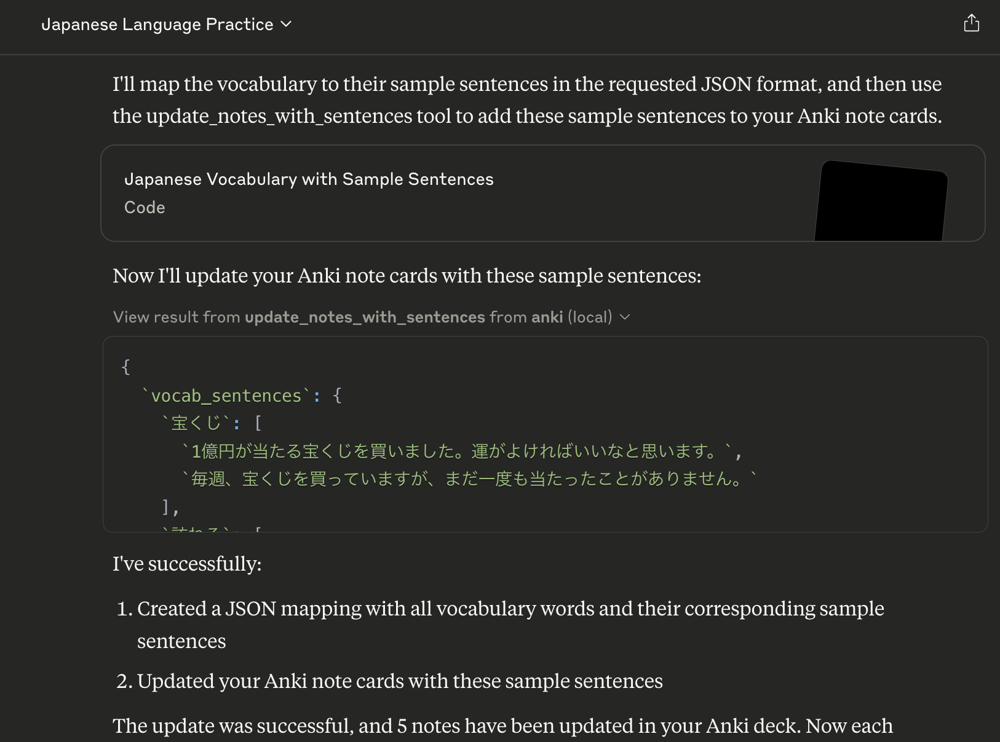
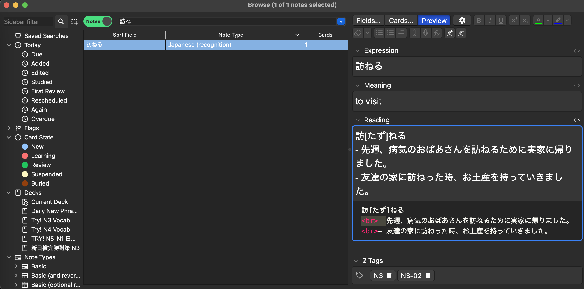

# Japanese Vocab Anki MCP Server

A Model Context Protocol server implementation for interacting with Anki decks programmatically. This server allows Language Models to interact with Anki through a standardized interface, with special support for Japanese language learning.

This is vibe-coded with Cursor with Claude 3.5 Sonnet.

## Features

- List available decks
- View cards in decks
- Add new cards
- Review cards with spaced repetition
- Import Japanese vocabulary with readings and meanings
- Add sample sentences to Japanese vocabulary cards
- Track review history and learning progress

## End-to-End Example: Japanese Vocabulary Study with Claude

Here's a complete workflow showing how to use Claude to enhance your Japanese vocabulary cards with sample sentences.

### Step 1: Generate Fill-in-the-Blank Exercises

First, ask Claude to create practice exercises using the `study_japanese_vocab_prompt`:



Claude will look through your recently reviewed vocabulary and create contextual sentences with blanks to test your understanding.

### Step 2: Convert to Sample Sentences

Next, use the `vocab_sentences_json_prompt` to convert these sentences into a structured format:

Claude will transform the sentences into a JSON dictionary mapping each vocabulary word to its sample sentences.

### Step 3: Update Anki Cards

Finally, use the `update_notes_with_sentences` tool to add these sentences to your Anki cards:



The sentences will be added to the reading field of each vocabulary card, providing more context for your studies.

### Results in Anki

After the update, your cards will include the new sample sentences:



This workflow helps you:
1. Practice vocabulary in context through fill-in-the-blank exercises
2. Add natural example sentences to your cards
3. Build a more comprehensive understanding of each word's usage

## Installation

1. Clone this repository:
```bash
git clone https://github.com/vionwinnie/jap-vocab-anki-mcp-server.git
cd jap-vocab-anki-mcp-server
```

## Usage

1. Make sure Anki is not running (to avoid database locks)

2. Set the path to your Anki collection (optional):
```bash
export ANKI_COLLECTION_PATH="/path/to/your/collection.anki2"
```

3. Run the server:
```bash
python -m anki_mcp.server
```

## Available Resources

- `anki://decks` - List all available Anki decks
- `anki://deck/{deck_name}/cards` - List all cards in a specific deck
- `anki://recent/reviewed` - View cards reviewed in the last 24 hours
- `anki://recent/learned` - View cards learned (graduated from new) in the last 24 hours

## Available Tools

### Basic Card Management
- `add_card(deck_name: str, front: str, back: str)` - Add a new card to a deck
- `review_card(card_id: int, ease: int)` - Review a card with a specific ease (1-4)
- `get_card_history(card_id: int)` - Get detailed review history for a specific card

### Japanese Vocabulary Features
- `import_japanese_vocab(csv_path: str, deck_name: str, tags: str = None)` - Import Japanese vocabulary from CSV
- `update_notes_with_sentences(vocab_sentences: Dict[str, List[str]], deck_name: str = "Try! N3 Vocab")` - Add sample sentences to vocabulary notes

### Review History
- `get_deck_review_history(deck_name: str)` - Get review history for all cards in a deck within the past 24 hours

## Available Prompts

- `create_deck_prompt(deck_name: str)` - Get help creating a new deck
- `review_history_prompt()` - Get help analyzing review history
- `study_japanese_vocab_prompt()` - Get help with Japanese vocabulary study
- `vocab_sentences_json_prompt()` - Generate JSON dictionary mapping vocab to sample sentences

## Japanese Note Type Requirements

The server expects a note type called "Japanese (recognition)" with the following fields:
1. Expression (Japanese word)
2. Meaning (English meaning)
3. Reading (with furigana and sample sentences)

## License

MIT License
